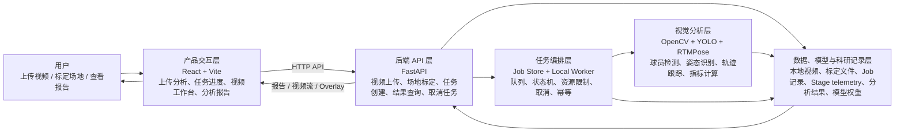
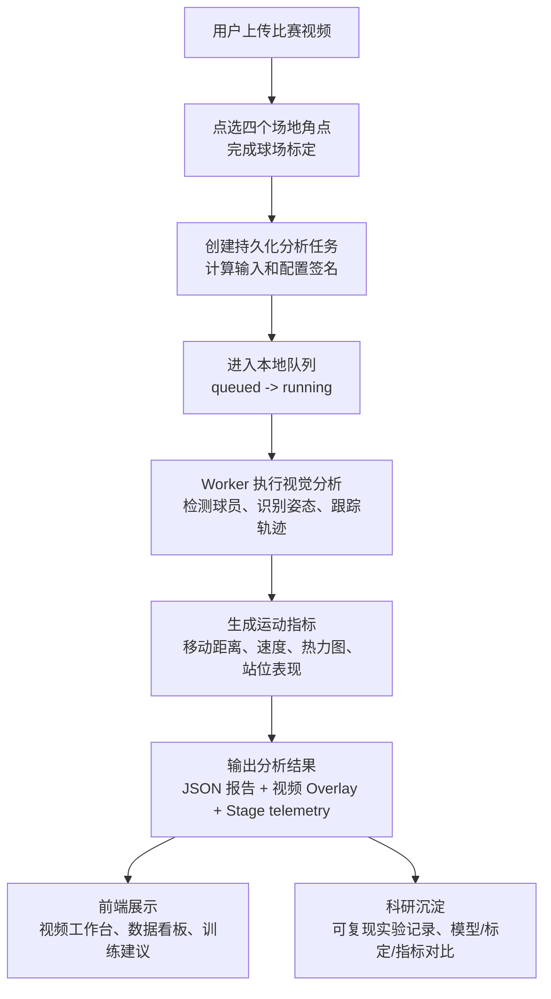

# 匹克球智能分析系统架构示意图

本系统定位为真实运行的匹克球视频分析产品和科研实验平台，不再只是比赛答辩展示页。架构重点是让真实视频分析任务稳定执行、可追踪、可复现，并把研发过程中形成的数据集、模型验证、标定方法、轨迹指标和训练反馈记录沉淀为后续科研产出。

## 1. 系统总体架构

## 2. 核心业务流程

## 3. 模块说明

| 模块 | 作用 |
| --- | --- |
| 产品交互层 | 提供视频上传、场地标定、任务进度、视频回放和报告展示界面；演示样例必须标注为样例数据 |
| 后端 API 层 | 负责接口管理、视频/标定/任务/结果查询和任务取消 |
| 任务编排层 | 负责 Job 状态机、持久化任务记录、队列、Worker 执行、资源限制、取消、幂等提交和阶段 telemetry |
| 视觉分析层 | 完成人体检测、姿态识别、轨迹跟踪、坐标投影和运动指标计算 |
| 数据、模型与科研记录层 | 保存上传视频、标定数据、Job 记录、阶段耗时/错误码、分析结果、Overlay 文件、本地模型权重和可复现实验记录 |

## 4. 产品与科研边界

- 产品主流程以真实上传视频为核心：上传、标定、排队、分析、查看视频叠加和报告。
- Demo/sample 路径继续保留，用于无后端或无模型资产时解释产品形态，但必须在页面上下文中和真实任务区分。
- 当前真实任务聚焦人员检测、姿态叠加、轨迹投影和移动指标；球追踪、击球事件、回合分割和战术语义在现阶段不作为真实结论输出。
- 科研产出来自研发过程中的可复现记录：输入/配置签名、阶段耗时、模型运行环境、标定质量、轨迹/姿态/热力图 artifact、失败诊断和指标对比。
