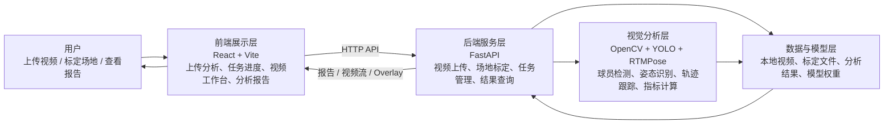
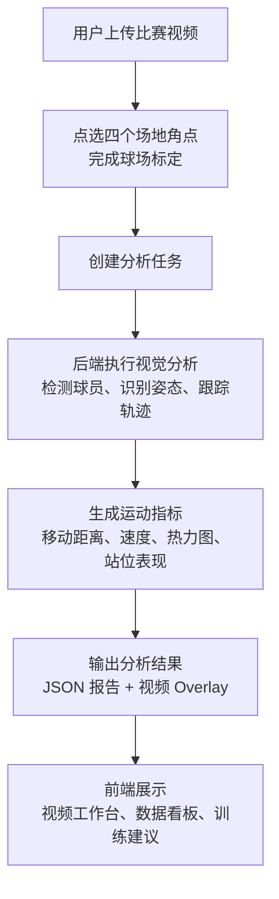

# 匹克球智能分析系统架构示意图

这版示意图用于汇报和展示，重点表达系统由“前端交互、后端接口、视觉分析、数据与模型”四部分组成。

## 1. 系统总体架构

## 2. 核心业务流程

## 3. 模块说明

| 模块 | 作用 |
| --- | --- |
| 前端展示层 | 提供视频上传、场地标定、任务进度、视频回放和报告展示界面 |
| 后端服务层 | 负责接口管理、任务调度、数据读写和分析结果返回 |
| 视觉分析层 | 完成人体检测、姿态识别、轨迹跟踪、坐标投影和运动指标计算 |
| 数据与模型层 | 保存上传视频、标定数据、分析结果、Overlay 文件和本地模型权重 |
