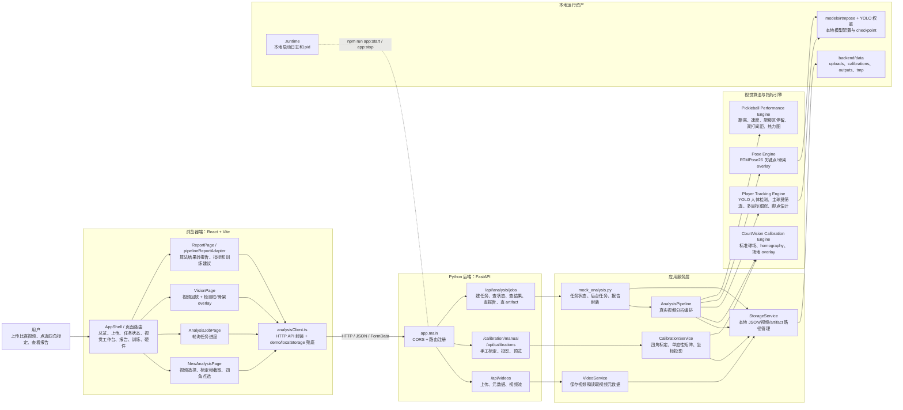
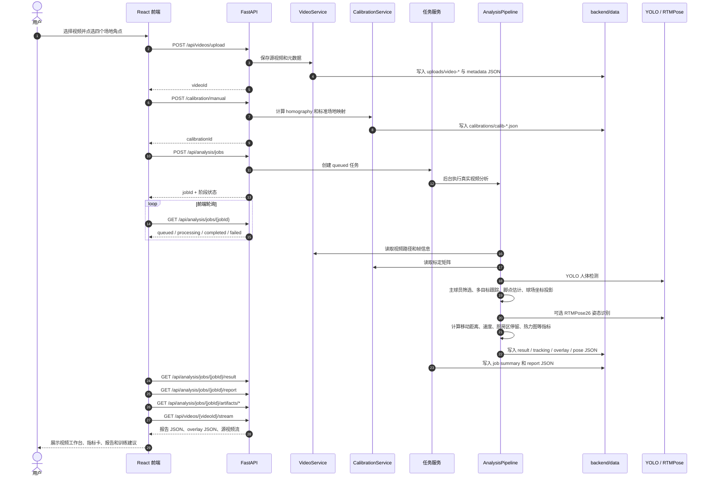
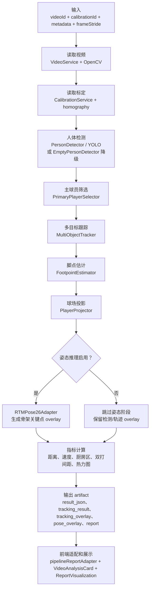

# 匹克球智能分析系统架构示意图

本文档根据当前仓库实现整理，覆盖浏览器端、FastAPI 后端、本地视觉算法流水线、模型资产和文件存储之间的关系。

## 1. 运行时总体架构

## 2. 视频分析数据流

## 3. 后端流水线分层

## 4. 关键模块对照

| 层级 | 主要文件/目录 | 责任 |
| --- | --- | --- |
| 前端入口 | `src/App.tsx` | 页面路由、上传标定流程、任务状态、视觉工作台、报告页 |
| API 客户端 | `src/services/analysisClient.ts` | 视频上传、标定、任务、结果、报告、overlay 请求 |
| 报告适配 | `src/services/pipelineReportAdapter.ts` | 将后端 pipeline result 转成前端报告模型 |
| FastAPI 入口 | `backend/app/main.py` | CORS、健康检查、路由注册 |
| API 路由 | `backend/app/api/` | 视频、标定、分析任务相关接口 |
| 服务层 | `backend/app/services/` | 存储、视频、标定、任务状态、pipeline 编排 |
| 算法层 | `backend/app/vision/` | 场地标定、检测跟踪、姿态、运动指标 |
| 本地数据 | `backend/data/` | 上传视频、标定文件、任务结果、overlay artifact |
| 模型资产 | `models/` | YOLO/RTMPose 配置和权重 |
| 本地运行 | `scripts/start-local-runtime.sh` | 同时启动后端和 Vite 前端，写入 `.runtime` 日志 |
