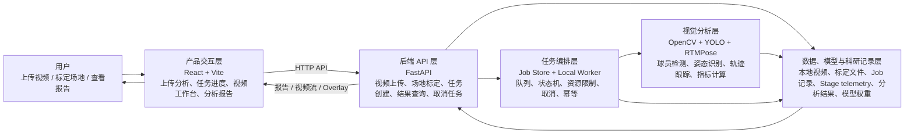
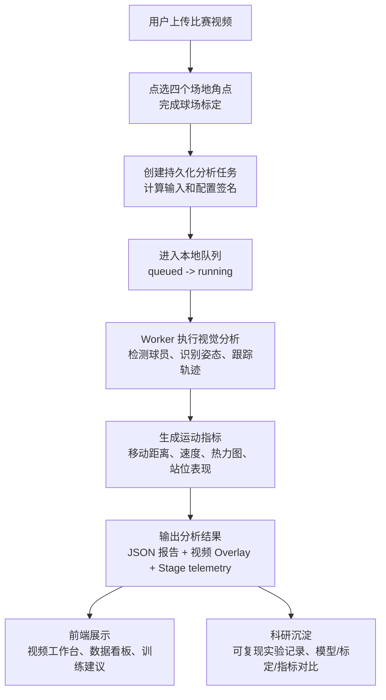

# 匹克球智能分析系统架构示意图

本系统定位为真实运行的匹克球视频分析产品和科研实验平台，不再只是比赛答辩展示页。架构重点是让真实视频分析任务稳定执行、可追踪、可复现，并把研发过程中形成的数据集、模型验证、标定方法、轨迹指标和训练反馈记录沉淀为后续科研产出。

## 1. 系统总体架构

## 2. 核心业务流程

## 3. 模块说明

| 模块 | 作用 |
| --- | --- |
| 产品交互层 | 提供视频上传、场地标定、任务进度、视频回放和报告展示界面；演示样例必须标注为样例数据 |
| 后端 API 层 | 负责接口管理、视频/标定/任务/结果查询和任务取消 |
| 任务编排层 | 负责 Job 状态机、持久化任务记录、队列、Worker 执行、资源限制、取消、幂等提交和阶段 telemetry |
| 视觉分析层 | 完成人体检测、姿态识别、轨迹跟踪、坐标投影和运动指标计算 |
| 数据、模型与科研记录层 | 保存上传视频、标定数据、Job 记录、阶段耗时/错误码、分析结果、Overlay 文件、本地模型权重和可复现实验记录 |

## 4. 产品与科研边界

- 产品主流程以真实上传视频为核心：上传、标定、排队、分析、查看视频叠加和报告。
- Demo/sample 路径继续保留，用于无后端或无模型资产时解释产品形态，但必须在页面上下文中和真实任务区分。
- 当前真实任务聚焦人员检测、姿态叠加、轨迹投影和移动指标；球追踪、击球事件、回合分割和战术语义在现阶段不作为真实结论输出。
- 科研产出来自研发过程中的可复现记录：输入/配置签名、阶段耗时、模型运行环境、标定质量、轨迹/姿态/热力图 artifact、失败诊断和指标对比。

## 5. 双摄 joint_tracking_v2 结果链路（2026-08-13 修复）

双摄分析（`analysisKind=multiview`，`executionMode=joint_tracking_v2`）的结果链路要点：

- **解帧语义**：`JointViewRuntime.get_frame` 必须用 `cv2.CAP_PROP_POS_FRAMES`（帧号）seek；曾误用 `set(0, ...)`（= CAP_PROP_POS_MSEC 毫秒）导致检测跑在错误帧、检测框每 ~5-8 tick 才更新。
- **fused 轨迹时间戳**：`fused_player_trajectory.v2` 样本必带 `timestamp_seconds`（writer 由 `take_timestamp_ms/1000` 派生；composer 读取优先级 `timestamp_seconds` → `take_timestamp_ms/1000` → 0.0）。缺失会导致速度/厨房停留指标全 0、前端小地图按时间窗口过滤后空白。
- **视觉层产物**：joint 模式无 child 单摄产物可继承，由 `joint_visual_artifacts.py` 从 debug trace / fused 轨迹生成：tracking_overlay（框架，从 debug trace 聚合）、heatmaps/scatter（复用 PositionVisualizer）；pose_overlay（骨架）与 player_render_trajectory 显式 `unavailable` + reason（joint 模式未接入 RTMPose / 无逐帧图像坐标）。
- **聚合 stage**：joint 模式 A/B 机位状态取 joint run 完成结论，不读创建后停摆的 `viewRuns`，避免误报 failed。
- **窗口开头副摄回退**：canonical 时间早于 sync `valid_start_seconds`（如 clipStart=0 时前 3.4s）时，clock 回退到有效起点帧并标记 `fallback_valid_start`（不消费 tracker），debug replay 渲染该近似帧画面而非 UNAVAILABLE 黑屏。
- **双摄产物落盘**：capture_take 的 session_dir 位于外接盘（`/Volumes/Elements/项目/匹克球/视频录制/captures/.../analysis/`），含 job 产物与 `multiview/mvr_<run_id>` 调试产物；本机 `backend/data/outputs` 仅存 report/job json。

## 5.1 Global Roster 全局比赛球员名单（2026-08-14）

双摄 `joint_tracking_v2` 的全局身份层采用 **fixed roster**（`stabilize-joint-global-player-roster`）：

- **三级生命周期**：`candidate_N`（未匹配正式观测的暂存，不占 slot、不参与预测）→ `provisional roster occupant`（晋升占 slot，`global_player_1..N`）→ `roster confirmed`（全部 slot 占用且每 occupant 稳定 K tick 或 ≥1 次可靠 cross-view anchoring 后进入 `ROSTER_ACTIVE`）。**slot 占满 ≠ roster 可信**。
- **候选归属规则**：同 `(view_id, view_player_id, epoch)` 强 key 复用 → 跨 epoch 弱 prior → 跨 view canonical geometry 邻域 → 才新建；同 view 两个不同 local players 不得合并；同 tick 同 candidate 每 view 至多一个 observation。
- **晋升**：双视角一致 ≥2 有效 tick（tick 级累积）或单视角 formal identity 稳定 ≥5 tick；候选过期窗口清理（不影响 roster）。
- **ROSTER_ACTIVE 后禁止创建 G5**：unmatched 观测只能 unresolved / recovery / reject；`GlobalPlayerRegistry(expected_player_count=N)`（来自 `match_context`：单打 2 / 双打 4）由 `_allocate_roster_slot()` 分配正式身份。
- **roster 重建边界**：仅 `new_match` / 显式 `roster_reset` / participant-change 才重建；**普通 local identity epoch reset、局盘切换、换边不重建**。
- **两级 continuity**：强绑定 `(view, Player_N, epoch) → global`（epoch reset 失效）+ 弱历史绑定 `(view, Player_N) → global`（epoch reset 后经 geometry/donor/prediction 重新证明回原 global，不无脑继承、不无脑新建）。
- **关联门**：uncertainty-aware（`gate = min(max_reacquire_gate_ft, base_gate_ft + scale×uncertainty)`），稳定连续紧门 / 历史重连随 uncertainty 扩展 / 换人尝试严格门；`PendingReassociation` 多帧强证据（switch_margin + challenger 连续一致）才切换。
- **stale 资格分离**：`uncertainty`/`last_seen_age` 超阈值后 roster 玩家退出普通紧门匹配（不吸附观测），仅经 historical continuity / guided recovery / strong reacquire 回归；confirmed roster 玩家出画不删除。
- **guided 强约束**：confirmed + anchored + guidance 明确 `expected_global_player_id` 的 guided_roi 观测优先恢复 expected；几何不可行 reject（不转投）；同 tick base 证据优先，stale guidance 不覆盖。
- **公开契约（关键）**：内部可讨论 `global_player_N`，但 `compose_joint_result` 经 `global-player-roster.v1`（诊断/映射 contract）把公开轨迹身份统一为 canonical `Player_1..4 / P1..P4`（**reference view binding 决定 display anchor**）；用户可见 trajectory/metrics/heatmap/report **不得出现 `global_player_`**。joint 路径生成与单摄同契约的 `position_visualizations/structured/data.json`（22×10 网格、P1-P4），前端 `StructuredHeatmap` 走 SVG。
- **球员计数**：区分 `expected_player_count` / `roster_occupied_count` / `confirmed_player_count` / `observed_player_count`，报告按实际确认/观测人数如实呈现（不硬写赛制人数）。
- **F1 冻结**：offline refinement 仅补 observation / 改善 fused position，输出 `global_player_id` ⊆ F0 snapshot，不得改 `global → Player_N` 映射、不得分配新 slot。
